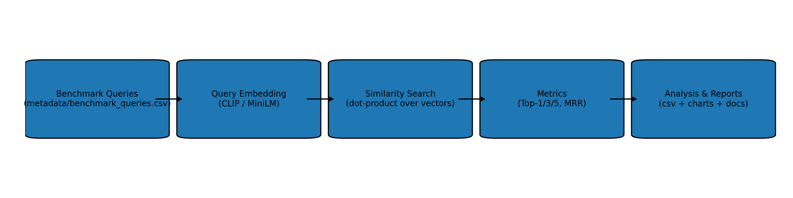
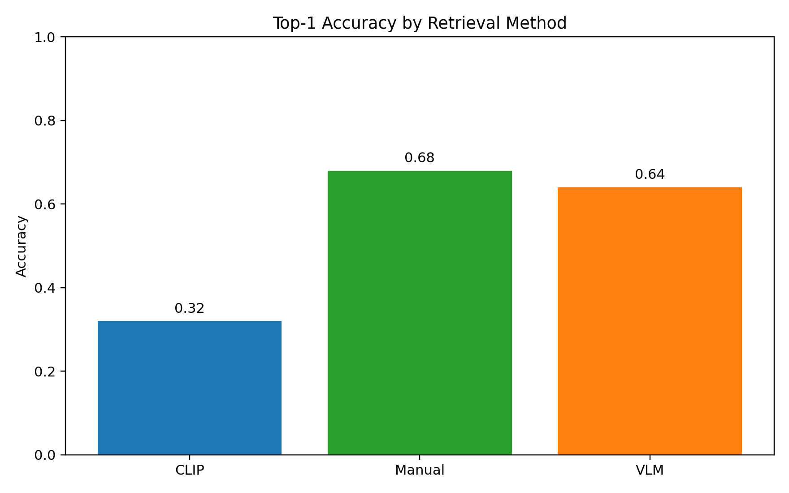
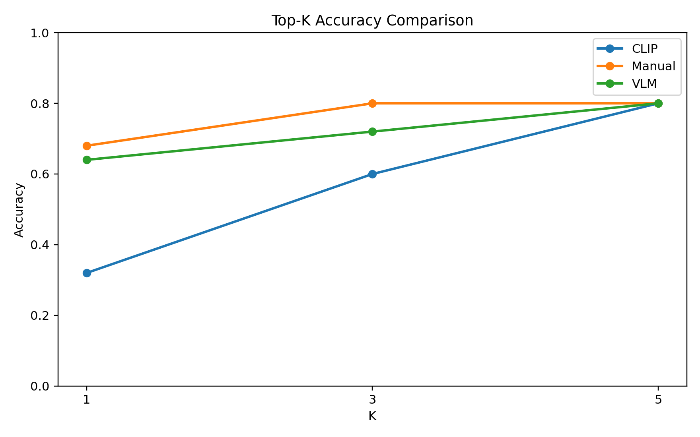
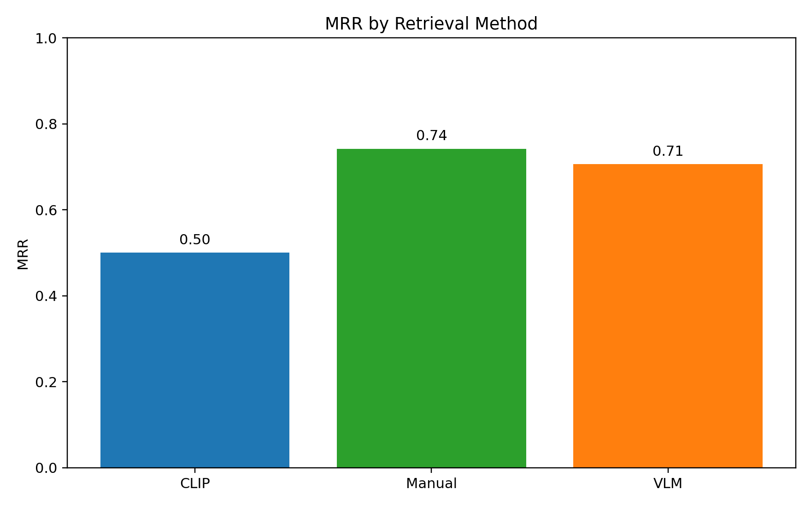
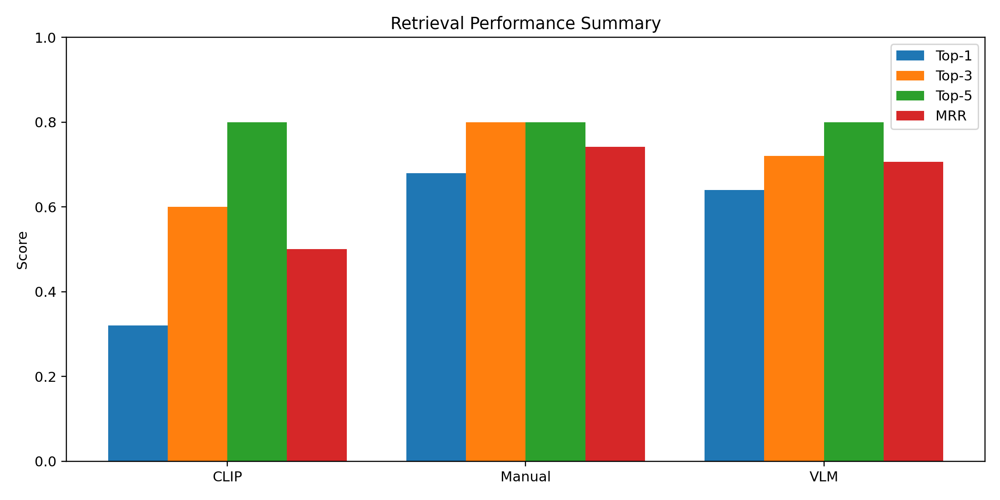

# Restaurant Image Retrieval Benchmark Report

## Abstract
This report benchmarks three restaurant image retrieval methods over the same 103-image corpus and 25 benchmark queries: CLIP image embeddings, manual caption embeddings, and VLM-generated caption embeddings. We evaluate with Top-1/Top-3/Top-5 Accuracy and Mean Reciprocal Rank (MRR), then analyze category behavior, failure modes, and practical limitations.

## Introduction
The project objective is to compare multimodal and text-based retrieval quality on a restaurant-focused dataset spanning food, ambience, and dining experience intents.

## Dataset Description
- Total images: **103**
- Benchmark queries: **25**
- Query categories: **Food, Ambience, Dining Experience**
- Embedding dimensions:
  - CLIP image vectors: **512**
  - Manual caption vectors: **384**
  - VLM caption vectors: **384**

## Methodology
1. Load benchmark queries from `metadata/benchmark_queries.csv`.
2. Retrieve against each embedding index independently.
3. Build transparent silver relevance sets from existing captions and query-category constraints.
4. Compute Top-1, Top-3, Top-5, and MRR per query and aggregate per method.

*Figure: End-to-end evaluation pipeline.*

## CLIP Baseline
CLIP uses text-query to image-embedding similarity (`openai/clip-vit-base-patch32`) against `embeddings/clip/image_embeddings.npy`.

## Manual Caption Baseline
Manual human-written captions are encoded with `all-MiniLM-L6-v2` and searched over `embeddings/manual/manual_embeddings.npy`.

## VLM Caption Baseline
VLM-generated captions use the same text encoder and are searched over `embeddings/vlm/vlm_embeddings.npy`.

## Experimental Setup
- Runtime mode: offline-safe model loading (`local_files_only=True`)
- Similarity: normalized dot product
- Top-K reported at K = 1, 3, 5
- Query count: 25

## Evaluation Metrics
- **Top-1 Accuracy**: first result is relevant
- **Top-3 Accuracy**: any relevant result in top 3
- **Top-5 Accuracy**: any relevant result in top 5
- **MRR**: reciprocal of first relevant rank

## Results
| method | top1_accuracy | top3_accuracy | top5_accuracy | mrr | top1_accuracy_pct | top3_accuracy_pct | top5_accuracy_pct |
| --- | --- | --- | --- | --- | --- | --- | --- |
| CLIP | 0.32 | 0.6 | 0.8 | 0.5 | 32.0 | 60.0 | 80.0 |
| Manual | 0.68 | 0.8 | 0.8 | 0.7419 | 68.0 | 80.0 | 80.0 |
| VLM | 0.64 | 0.72 | 0.8 | 0.7062 | 64.0 | 72.0 | 80.0 |

*Figure: Top-1 accuracy by method.*

*Figure: Top-K curve (K=1,3,5) for each method.*

*Figure: MRR by method.*

*Figure: Combined Top-1/3/5 and MRR summary.*

## Discussion
- Strongest method (by MRR): **Manual**
- Weakest method (by MRR): **CLIP**
- CLIP MRR gap vs best method: **0.2419**
- Manual vs VLM deltas (VLM - Manual):
  - Top-1: **-0.0400**
  - Top-3: **-0.0800**
  - Top-5: **+0.0000**
  - MRR: **-0.0357**

Category-level behavior:
| category | method | top1 | top3 | top5 | mrr |
| --- | --- | --- | --- | --- | --- |
| Ambience | CLIP | 0.0 | 0.6 | 0.8 | 0.3452 |
| Ambience | Manual | 0.6 | 0.6 | 0.6 | 0.6276 |
| Ambience | VLM | 0.2 | 0.4 | 0.6 | 0.3667 |
| Dining Experience | CLIP | 0.4 | 0.6 | 0.6 | 0.4827 |
| Dining Experience | Manual | 0.6 | 0.6 | 0.6 | 0.609 |
| Dining Experience | VLM | 0.4 | 0.4 | 0.6 | 0.4577 |
| Food | CLIP | 0.4 | 0.6 | 0.8667 | 0.5574 |
| Food | Manual | 0.7333 | 0.9333 | 0.9333 | 0.8244 |
| Food | VLM | 0.8667 | 0.9333 | 0.9333 | 0.9022 |

## Failure Analysis
Representative failure cases (top-1 miss):
| query | category | method | first_relevant_rank | top1_path |
| --- | --- | --- | --- | --- |
| Sweet Kesari with dry fruits | Food | CLIP | 2.0 | Restaurant_food_datasets/Murugan_Idli_Shop/murugan_idli_shop_006.webp |
| Authentic idli sambar breakfast | Food | CLIP | 2.0 | Restaurant_food_datasets/Sangeetha_Veg_Restaurant/sangeetha_veg_restaurant_007.webp |
| Fine dining restaurant ambiance | Ambience | CLIP | 2.0 | Restaurant_food_datasets/southern_spice/southern_spice_005.webp |
| Traditional decor restaurant interior | Ambience | CLIP | 2.0 | Restaurant_food_datasets/southern_spice/southern_spice_014.webp |
| Flavorful Hyderabadi Veg Biryani | Food | CLIP | 3.0 | Restaurant_food_datasets/a2b/a2b_006.webp |
| Bright well-lit dining area | Ambience | CLIP | 3.0 | Restaurant_food_datasets/Dindigul_Thalappakatti/dindigul_thalappakatti_018.webp |
| Sunday brunch buffet | Dining Experience | CLIP | 3.0 | Restaurant_food_datasets/Absolute_Barbecues/absolute_barbecues_012.webp |
| Spicy Mutton Sukka | Food | CLIP | 4.0 | Restaurant_food_datasets/southern_spice/southern_spice_016.webp |
| Mini Idli with sambar dip | Food | CLIP | 4.0 | Restaurant_food_datasets/Sangeetha_Veg_Restaurant/sangeetha_veg_restaurant_007.webp |
| Spicy Chilli Chicken | Food | CLIP | 4.0 | Restaurant_food_datasets/Sangeetha_Veg_Restaurant/sangeetha_veg_restaurant_010.webp |
| Modern restaurant interior | Ambience | CLIP | 4.0 | Restaurant_food_datasets/Dindigul_Thalappakatti/dindigul_thalappakatti_005.webp |
| Kothu Parotta with salna | Food | CLIP | 5.0 | Restaurant_food_datasets/Murugan_Idli_Shop/murugan_idli_shop_005.webp |

Qualitative strong examples (top-1 hit):
| query | category | method | top1_path | top1_score |
| --- | --- | --- | --- | --- |
| Masala Vada and coconut chutney | Food | CLIP | Restaurant_food_datasets/Murugan_Idli_Shop/murugan_idli_shop_004.webp | 0.3441511392593384 |
| Traditional banana leaf meal | Dining Experience | CLIP | Restaurant_food_datasets/Dindigul_Thalappakatti/dindigul_thalappakatti_025.webp | 0.3394358158111572 |
| Tableside live grilling | Dining Experience | Manual | Restaurant_food_datasets/Absolute_Barbecues/absolute_barbecues_002.webp | 0.7674733400344849 |
| Masala Vada and coconut chutney | Food | Manual | Restaurant_food_datasets/Murugan_Idli_Shop/murugan_idli_shop_004.webp | 0.7322336435317993 |
| Tableside live grilling | Dining Experience | VLM | Restaurant_food_datasets/Absolute_Barbecues/absolute_barbecues_002.webp | 0.7674733400344849 |
| Traditional banana leaf meal | Dining Experience | VLM | Restaurant_food_datasets/southern_spice/southern_spice_007.webp | 0.7571135759353638 |

## Limitations
1. Benchmark queries do not include explicit human-annotated relevance labels; this evaluation uses transparent silver relevance from existing captions and metadata.
2. Dataset size is modest (103 images), so metric variance is relatively high query-to-query.
3. Caption quality and consistency strongly influence text-embedding methods.

## Future Work
1. Add human-validated multi-label relevance judgments per query.
2. Expand queries with harder compositional prompts and negatives.
3. Evaluate additional encoders and rerankers (cross-encoder or late interaction).
4. Add confidence intervals via bootstrap resampling.

## Conclusion
The benchmark provides a complete, reproducible comparison across CLIP image retrieval, manual caption retrieval, and VLM-caption retrieval on the project dataset. Results, charts, and detailed per-query outputs are now generated and ready for submission and presentation.
